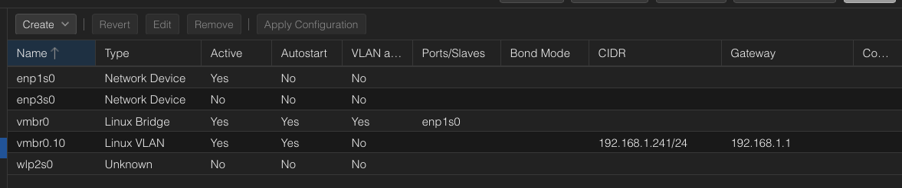

# Next deployment notes

- Use https://registry.terraform.io/modules/bbtechsys/talos/proxmox/latest !!!
- Configure replicated storage on all nodes 32GB local-zfs / 128 local-data / 128 replicated-data - expand as required
- K8s multi-master single-node hybrid architecture for better resource utilisation

## Configure network



## On local client

```bash
for host in pve01 pve02 pve03; do ssh-keygen -R $host; done
for host in pve01 pve02 pve03; do ssh-copy-id -o StrictHostKeyChecking=no root@$host; done
```

## Configure linux bond

SSH into pveXX and run (REPLACE IP):

```bash
cat << 'EOF' > /etc/network/interfaces
# network interface settings; autogenerated
# Please do NOT modify this file directly, unless you know what
# you're doing.
#
# If you want to manage parts of the network configuration manually,
# please utilize the 'source' or 'source-directory' directives to do
# so.
# PVE will preserve these directives, but will NOT read its network
# configuration from sourced files, so do not attempt to move any of
# the PVE managed interfaces into external files!

auto lo
iface lo inet loopback

auto enp1s0
iface enp1s0 inet manual

auto enp2s0
iface enp2s0 inet manual

iface wlp3s0 inet manual

auto bond0
iface bond0 inet manual
	bond-slaves enp1s0 enp2s0
	bond-miimon 100
	bond-mode 802.3ad
  bond-xmit-hash-policy layer3+4

auto vmbr0
iface vmbr0 inet static
	address 192.168.2.243/24
	gateway 192.168.2.1
	bridge-ports bond0
	bridge-stp off
	bridge-fd 0
	bridge-vlan-aware yes
	bridge-vids 2-4094

source /etc/network/interfaces.d/*
EOF

ifreload -a
```

## Configure apt

```bash
#!/bin/bash
set -e

echo ">>> Disabling Proxmox enterprise repo"
sed -i.bak 's/^deb https:/#deb https:/' /etc/apt/sources.list.d/pve-enterprise.list 2>/dev/null || true

echo ">>> Disabling Ceph enterprise repo (if exists)"
sed -i.bak 's|^deb https://enterprise.proxmox.com/debian/ceph.*|# &|' /etc/apt/sources.list.d/*ceph*.list 2>/dev/null || true

echo ">>> Adding Proxmox no-subscription repo"
echo "deb http://download.proxmox.com/debian/pve bookworm pve-no-subscription" \
  > /etc/apt/sources.list.d/pve-install-repo.list

echo ">>> Adding Debian main repos"
cat <<EOF > /etc/apt/sources.list.d/debian.list
deb http://deb.debian.org/debian bookworm main contrib
deb http://deb.debian.org/debian bookworm-updates main contrib
deb http://security.debian.org/debian-security bookworm-security main contrib
EOF

echo ">>> Downloading Proxmox GPG key"
wget -q https://enterprise.proxmox.com/debian/proxmox-release-bookworm.gpg \
  -O /etc/apt/trusted.gpg.d/proxmox-release-bookworm.gpg

echo ">>> Updating and upgrading"
apt update
apt -y full-upgrade
apt autoremove -y
apt clean

echo ">>> DONE"
reboot
```

## On primary node

```bash
pvecm create pve-cluster01
```

## On joining nodes

```bash
pvecm add pve01
```

## Add shared storage

### Backup storage etc

```bash
pvesm add nfs remote-hdd \
    -server truenas.internal \
    -export /mnt/tank-smr/proxmox \
    -path /mnt/pve/remote-hdd \
    -content snippets,vztmpl,backup,iso,import \
    -options vers=4 \
    --prune-backups keep-all=1
```

### VM disks

```bash - RUN ON PRIMARY NODE!
########################################## PART 1
# 1) Add the raw iSCSI LUN (NO content)
pvesm add iscsi remote-iscsi \
  -portal truenas.internal \
  -target iqn.2005-10.org.freenas.ctl:proxmox-vm \
  -content none

# 2) Grab the device path that appeared
ls -l /dev/disk/by-id/ | grep -i truenas
########################################## PART 2
DEV=/dev/disk/by-id/scsi-STrueNAS_iSCSI_Disk_42b7572be7b271e # <-- replace!!!

# 3) Put LVM on top of that LUN
pvcreate "$DEV"
vgcreate vg-remote-thin "$DEV"
lvcreate -l 100%FREE -T -n thinpool vg-remote-thin

# 4) Register the thinpool as Proxmox storage
pvesm add lvmthin remote-thin \
  -vgname vg-remote-thin \
  -thinpool thinpool \
  -content images,rootdir

# 5) (Optional but recommended in a cluster)
pvesm set remote-thin --shared 1 2>/dev/null || true

# 6) Verify
pvesm status
lvs -o lv_name,vg_name,attr,data_percent,metadata_percent vg-remote-thin
```

Then reboot other nodes.

LXCs:

```bash
pvesm add nfs remote-nfs \
  -server truenas.internal \
  -export /mnt/tank-ssd/proxmox-lxc \
  -path /mnt/pve/remote-nfs \
  -content rootdir \
  -options vers=4
```

## Datacenter configuration

Double check current settings:

```bash
cat /etc/pve/datacenter.cfg
```

Configure:

```bash
cat <<EOF > /etc/pve/datacenter.cfg
keyboard: en-us
tag-style: color-map=dmz:ff2600:FFFFFF
EOF
```

## Configure Backup

```bash
pvesh create /cluster/backup \
  --id daily-all-9pm \
  --all 1 \
  --storage remote-hdd \
  --mode snapshot \
  --compress zstd \
  --schedule 21:00 \
  --mailto gregcourt10@gmail.com \
  --prune-backups 'keep-daily=7,keep-weekly=4,keep-monthly=3' \
  --notes-template '{{guestname}}' \
  --enabled 1
```
